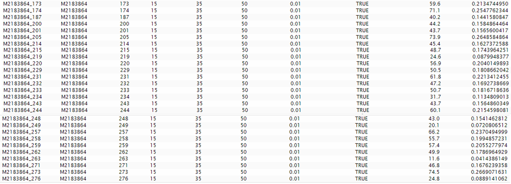

```{r setup, include=FALSE}
knitr::opts_chunk$set(echo = TRUE,
                      eval = TRUE)

library(RJobTissueArea)
```

# intro 

**Jennys findings**

Hi Jule,

ich hab heute das Area calculation script genutzt und habe hier eine deutliche Diskrepanz bei der bestimmten Area per FOV festgestellt.

Bei den Chips wurden FOV gewählt, die nahezu voll mit Gewebe sind.  Daher sind mir vorallem die Chips mit nur 30 bzw. 40% Gewebeabdeckung aufgefallen. Diese Werte können nicht richtig sein.

```{r}
JennyResult <- data.frame(
  chip_ID = c("M2183864","M2183872","M2183874","M2183878","M2183880","M2183882","M2183884","M2183890","M2183896"),
  FOV = c(40,43,34,30,40,43,39,43,31),
  perc=c(46.8925,75.9814,32.43235,38.7,43.3725,46.46977,78.48718,57.96977,61.69355),
  Area = c(6.720818,11.732213,3.957772,4.128046,6.136645,7.12264,10.883047,8.95558,6.831417),
  calculatedArea = c(14,15.05,11.9,10.5,14,15.05,13.65,15.05,10.85))

output_dir <- "data_output/BUGS/26240"%>%create_working_directory()

chip_IDs <- JennyResult$chip_ID
```

Ich hab mir Chip M2183864 einmal genauer angeschaut. Hier sind bei einigen Positionen nur um die 20% angegeben. Z.B. Position 219 und 249. Und beide Positionen sind nahezu voll von Gewebe bedeckt. 

Die Chips wurden in Hannover auf dem Zellscanner gemessen. Da scheint noch irgendwo was in dem Script fehlerhaft zu sein.



# prepare input

**create ScanHistory**

```{r}
ScanHistory <- create_ScanHistory_extended(chip_IDs,
                                           output_dir,
                                           result_ID = group_ID)
```

**select valid hdr image groups**

```{r}
image_groups <- create_hdr_image_groups(ScanHistory)
```

# check input 

**reported chip_ID - positions are not correct**

```{r}
image_groups%>%
  dplyr::filter(
   group_ID %in% paste0(JennyResult$chip_ID,"_",JennyResult$FOV))
 
```

```{r}
chip_ID <- "M2183864"
positions <- c(219,249)
pos <- which(image_groups$group_ID %in% paste0(chip_ID,"_",positions))
```

**apply tissue detection workflow**

```{r}
process_TissueDetectionWorkflow(image_groups,
                                output_dir,
                                sigma = 15,
                                threshold = 1, #35, #
                                window = 50,
                                attenuation = 0, #0.01, #
                                noiseReduction = TRUE,
                                plot_image =TRUE, 
                                export_result = TRUE,
                                result_ID = "noiseReduction")
```


# process parametes

with RJobTissueArea Version 0.0.0.22 the tissue detection algorithm was extended by options for noise reduction and attenuation of tiny bright pixels.

Attenuation of bright pixel spots general yield in a better tissue detection. Noise reduction especially play a role for images containing artefacts and background noise. With the use of noiseReduction a theshold of 1 is recommended.

The threshold defines the greyvalue above which a pixels is assigned to tissue group. A high threshold potentially result a lower tissue area. A very low threshold may affect that background counts as tissue.  

**standard parameter-settings:**

+---------------+---------------+---------------+----------------------------------------------------+
| threshold     | attenuation   | noiseReduction| Advantages                                         |
+===============+===============+===============+====================================================+
| 4             | 0             | FALSE         | - without attenuation or noise reduction           |
|               |               |               |   (best setting in package versions < 0.0.0.22     |
+---------------+---------------+---------------+----------------------------------------------------+
| 1             | 0             | TRUE          | - noise reduction                                  |
+---------------+---------------+---------------+----------------------------------------------------+
| 35            | 0.01          | FALSE         | - attenuation                                      |
+---------------+---------------+---------------+----------------------------------------------------+
| 35            | 0.01          | TRUE          | - attenuation and noise reduction                  |
+---------------+---------------+---------------+----------------------------------------------------+
| 25            | 0.01          | TRUE          | - lower threshold + attenuation and noise reduction|
+---------------+---------------+---------------+----------------------------------------------------+

## without improvements

- tissue image (left) and result tissueDetection result (right)
- no tissue: black, detected tissue: white

 


## with attenuation


## noise reduction


## with attenuation and noise reduction


